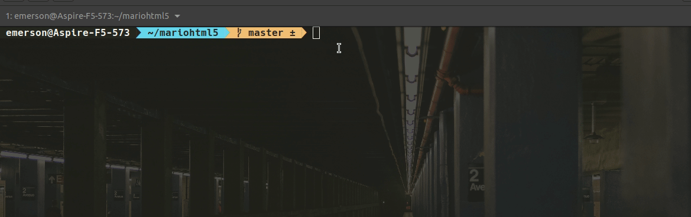

# Kubernetes Super Mario
Infinite Mario in HTML5 JavaScript - using Canvas and Audio elements


This a fork: [PengBAI/mariohtml5](https://github.com/PengBAI/mariohtml5)


[](https://hub.docker.com/r/pengbai/docker-supermario/)





Image on docker hub: [https://hub.docker.com/r/pengbai/docker-supermario/](https://hub.docker.com/r/pengbai/docker-supermario/)

## Run Deployment


```
kubectl apply -f manifest

```

```
kubectl port-forward deployment/supermario-deployment 8600:8080

```


